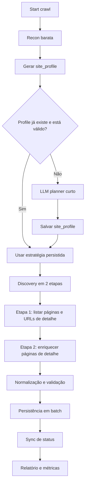
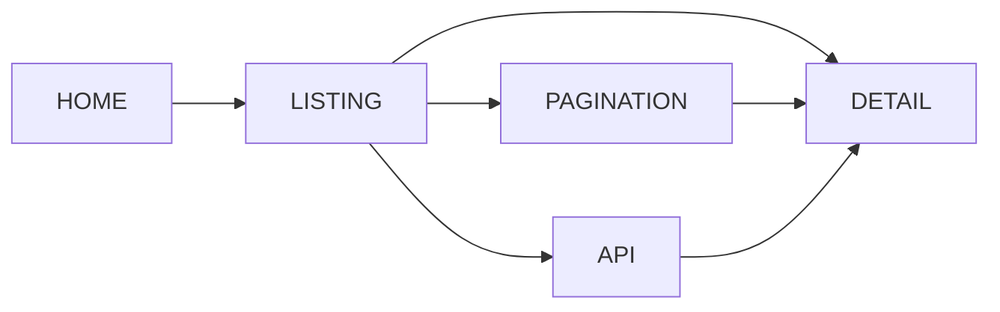
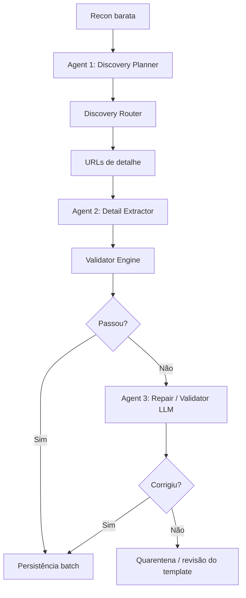
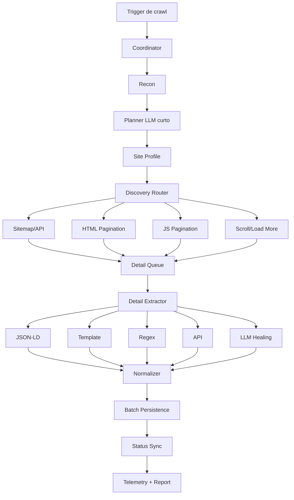

# Revisão de Arquitetura do Web Scraping

## Índice

1. Objetivo
2. Resumo Executivo
3. Estado Atual
4. Problemas Atuais
5. O Que Deve Ser Preservado
6. Princípio da Nova Arquitetura
7. Fluxo Proposto
8. Router de Crawl
9. Como Fica a LLM
10. Por Que Isso Não Deve Ficar Mais Lento
11. Exemplos de Decisão por Domínio
12. Melhorias Propostas
13. Como Isso Entra no Que Já Existe
14. Arquitetura Multi-Agente
15. Validação da Extração
16. Score de Confiança por Campo
17. Estratégia de Double-Check
18. Quando o Template Está Errado
19. Estrutura de Agentes e Prompts
20. Como Isso Entra Sem Ficar Mais Lento
21. Próxima Evolução Recomendável
22. Arquitetura Proposta
23. Fases de Implantação
24. Métricas de Sucesso
25. Riscos e Trade-offs
26. Conclusão
27. Referências Externas
28. Referências Internas do Projeto
29. Próximo Passo Sugerido

### Índice clicável

1. [Objetivo](#objetivo)
2. [Resumo Executivo](#resumo-executivo)
3. [Estado Atual](#estado-atual)
4. [Problemas Atuais](#problemas-atuais)
5. [O Que Deve Ser Preservado](#o-que-deve-ser-preservado)
6. [Princípio da Nova Arquitetura](#princípio-da-nova-arquitetura)
7. [Fluxo Proposto](#fluxo-proposto)
8. [Router de Crawl](#router-de-crawl)
9. [Como Fica a LLM](#como-fica-a-llm)
10. [Por Que Isso Não Deve Ficar Mais Lento](#por-que-isso-não-deve-ficar-mais-lento)
11. [Exemplos de Decisão por Domínio](#exemplos-de-decisão-por-domínio)
12. [Melhorias Propostas](#melhorias-propostas)
13. [Como Isso Entra no Que Já Existe](#como-isso-entra-no-que-já-existe)
14. [Arquitetura Multi-Agente](#arquitetura-multi-agente)
15. [Validação da Extração](#validação-da-extração)
16. [Score de Confiança por Campo](#score-de-confiança-por-campo)
17. [Estratégia de Double-Check](#estratégia-de-double-check)
18. [Quando o Template Está Errado](#quando-o-template-está-errado)
19. [Estrutura de Agentes e Prompts](#estrutura-de-agentes-e-prompts)
20. [Como Isso Entra Sem Ficar Mais Lento](#como-isso-entra-sem-ficar-mais-lento)
21. [Próxima Evolução Recomendável](#próxima-evolução-recomendável)
22. [Arquitetura Proposta](#arquitetura-proposta)
23. [Fases de Implantação](#fases-de-implantação)
24. [Métricas de Sucesso](#métricas-de-sucesso)
25. [Riscos da Mudança](#riscos-da-mudança)
26. [Conclusão](#conclusão)
27. [Referências Externas](#referências-externas)
28. [Referências Internas do Projeto](#referências-internas-do-projeto)
29. [Próximo Passo Sugerido](#próximo-passo-sugerido)

<a id="objetivo"></a>
## Objetivo

Este documento consolida uma revisão técnica do pipeline atual de scraping do projeto, os principais problemas observados, e uma proposta de evolução da arquitetura com foco em:

- maior cobertura entre sites diferentes
- menor custo operacional
- menor latência média por crawl
- menos complexidade acidental
- melhor documentação e observabilidade

O objetivo não é remover o uso de LLM. O objetivo é reposicionar a LLM para o ponto onde ela traz mais generalidade com menos custo: como planejadora de estratégia, e não como caminho padrão em quase todas as etapas.

---

<a id="resumo-executivo"></a>
## Resumo Executivo

Hoje o pipeline tem boa ambição de generalidade, mas a generalidade foi colocada dentro de um fluxo monolítico. Descoberta, paginação, scroll, fallback de sessão, template learning, healing por LLM, sync incremental, heartbeat, status e relatórios convivem dentro do mesmo worker.

Isso gera alguns efeitos colaterais:

- o caminho padrão já começa caro
- fica difícil saber onde está a lentidão real
- os fallbacks crescem sem um contrato claro
- a documentação do sistema não reflete o runtime atual
- existe código legado/alternativo ainda no repositório

A proposta deste documento é:

1. manter LLM no pipeline
2. mover LLM para o papel de `planner / router`
3. separar claramente descoberta, navegação e extração
4. persistir aprendizado por domínio
5. reduzir caminhos duplicados
6. medir desempenho por etapa

---

<a id="estado-atual"></a>
## Estado Atual

## Fluxo em produção hoje

O fluxo principal atualmente roda com:

- app Next.js em Vercel
- worker Python em Railway
- Scrapling + StealthyFetcher
- enriquecimento com regex + template + LLM
- polling de progresso via banco

Arquivos centrais:

- `worker-python/main.py`
- `worker-python/app/crawler.py`
- `worker-python/app/extractor.py`
- `worker-python/app/db.py`
- `app/api/fontes/[id]/crawl/route.ts`
- `app/api/fontes/[id]/status/route.ts`

## Sinais de divergência arquitetural

O repositório ainda contém uma segunda arquitetura de crawling/documentação:

- `worker/` com worker TypeScript
- `lib/crawler/firecrawl.ts`
- `lib/inngest/functions/crawl-fonte.ts`
- `lib/inngest/functions/enrich-batch.ts`
- `app/api/webhooks/inngest/route.ts`
- `PLANO.md` ainda descrevendo `Crawlee + Playwright + Inngest`

Na prática, isso sugere que o sistema evoluiu, mas a documentação e parte do código legado não acompanharam a arquitetura que está de fato rodando.

---

<a id="problemas-atuais"></a>
## Problemas Atuais

## 1. Pipeline monolítico

Hoje a função de descoberta em `worker-python/app/crawler.py` concentra responsabilidades demais:

- análise inicial do site
- tentativa de listagens
- paginação por URL
- paginação via JS
- scroll / load more
- fallback por sessão
- fallback de fallback
- propagação de sinal de SPA para enriquecimento

Efeitos:

- difícil testar
- difícil explicar
- difícil otimizar sem quebrar cobertura
- difícil saber qual fallback realmente resolveu

## 2. Caminho padrão já é caro

Na descoberta, o sistema já entra cedo em browser e LLM.

Problema:

- browser cedo demais aumenta RAM e tempo
- LLM cedo demais aumenta custo e variância
- os caminhos baratos não são o default operacional

## 3. LLM com papel amplo demais

A LLM hoje ajuda em:

- análise de estrutura do site
- extração de detalhe
- template learning
- healing de campos faltantes
- micro-extração de localização

Isso dá cobertura, mas mistura:

- decisão de estratégia
- parsing
- correção
- fallback

Quando tudo usa LLM, fica difícil responder:

- a lentidão foi da navegação ou da inferência?
- o erro veio do DOM, do HTML ou do modelo?
- o custo subiu porque o site mudou ou porque o fluxo está chamando LLM demais?

## 4. Escritas no banco são linha a linha

Hoje tanto o upsert quanto parte do fluxo de indisponibilidade usam SQL por imóvel.

Efeitos:

- mais round-trips
- mais tempo total
- mais pressão desnecessária no DB

## 5. Execução não é durável

O worker atual dispara o crawl em thread local no processo HTTP.

Efeitos:

- restart do container interrompe crawl
- deploy ou crash derruba execução em andamento
- não há retomada real

## 6. Falta de suíte de regressão de scraping

Há muitos scripts de diagnóstico pontual, mas o projeto não comunica claramente uma suíte de regressão com asserts por site.

Efeitos:

- o sistema cresce por tentativa e erro
- cada ajuste de paginação pode quebrar outro domínio
- confiança operacional fica baixa

## 7. Documentação desalinhada com runtime

O `PLANO.md` ainda descreve uma stack diferente da que roda de verdade.

Efeitos:

- novos ajustes podem ser feitos na camada errada
- manutenção futura fica mais lenta
- a arquitetura parece mais simples no papel do que é no código

---

<a id="o-que-deve-ser-preservado"></a>
## O Que Deve Ser Preservado

Nem tudo deve ser substituído. Há ideias boas no pipeline atual que valem preservar:

- uso de Scrapling para fetch adaptativo
- cache por domínio de `requires_stealth`
- template learning por site
- sync incremental de URLs
- heartbeat de progresso para o frontend
- visão de cobertura ampla entre sites muito heterogêneos

Também faz sentido preservar a intuição original:

> usar LLM para generalizar entre milhares de sites que estruturam listagem, paginação e detalhe de formas diferentes

Essa intuição está correta. O ajuste é arquitetural: a LLM deve decidir a rota mais provável, e não ser a primeira resposta para tudo.

---

<a id="princípio-da-nova-arquitetura"></a>
## Princípio da Nova Arquitetura

## Ideia central

Trocar o papel da LLM de:

- extrator e fallback frequente

para:

- planejador de estratégia por domínio
- classificador de página
- reparador de exceções

Em vez de:

`browser -> LLM -> fallback -> fallback`

o fluxo passa a ser:

`recon barata -> LLM planner curto -> rota escolhida -> fallback controlado`

---

<a id="fluxo-proposto"></a>
## Fluxo Proposto

## Visão geral



## Recon barata

Antes de usar browser pesado ou LLM longa, coletar um pacote curto de sinais:

- `robots.txt`
- `sitemap.xml`
- links da home
- padrões de URL encontrados
- scripts carregados
- presença de framework
- HTML SSR ou shell de SPA
- existência de API/XHR óbvia

Exemplo de sinais úteis:

- `/imoveis`, `/comprar`, `/venda`, `/alugar`
- links com `page=2`, `pagina=2`, `offset=`
- scripts contendo `next`, `nuxt`, `react`, `wp-json`
- endpoints internos expostos

Essa fase deve ser barata e rápida.

## LLM planner curto

Em vez de mandar HTML longo, mandar um resumo pequeno com evidências.

Exemplo de saída esperada:

```json
{
  "framework": "nextjs",
  "listing_strategy": "html_links",
  "pagination_mode": "query_param",
  "pagination_param": "page",
  "detail_url_pattern": "/imovel/",
  "requires_js": true,
  "requires_stealth": false,
  "preferred_listing_urls": [
    "https://site.com/imoveis/venda"
  ],
  "confidence": 0.84
}
```

O planner não extrai imóvel. Ele define rota.

## Site profile persistido

Salvar por domínio um `site_profile` em `fonte.config` ou tabela dedicada:

- `framework`
- `listing_urls`
- `listing_strategy`
- `pagination_mode`
- `pagination_param`
- `detail_url_patterns`
- `requires_js`
- `requires_stealth`
- `api_endpoints`
- `template_version`
- `last_verified_at`
- `confidence`

Isso permite:

- segundo crawl mais rápido
- menos LLM repetida
- menos tentativa cega

## Discovery em duas etapas

Inspirado no conceito de deep scraping:

- Etapa A: descobrir páginas/listagens e URLs de detalhe
- Etapa B: enriquecer páginas de detalhe

Separar essas duas etapas ajuda porque o problema de paginação não é o mesmo problema da extração do imóvel.

### Etapa A: listagem

Objetivo:

- identificar listagens corretas
- navegar paginação
- retornar conjunto de detail URLs

Estratégias possíveis:

- `sitemap-first`
- `api-first`
- `html-pagination`
- `js-pagination`
- `scroll-load-more`

### Etapa B: detalhe

Objetivo:

- extrair campos do imóvel com o menor custo possível

Ordem sugerida:

1. JSON-LD
2. meta tags / structured data
3. selectors persistidos do template
4. regex / heurística
5. API interna, se houver
6. LLM healing

---

<a id="router-de-crawl"></a>
## Router de Crawl

Uma boa forma mental de organizar isso é por labels, como em routers de crawl:

- `HOME`
- `LISTING`
- `DETAIL`
- `PAGINATION`
- `API`
- `UNKNOWN`

### Exemplo conceitual



Benefícios:

- cada tipo de página tem contrato próprio
- logs ficam mais claros
- fallbacks ficam localizados
- testes por tipo de página ficam mais fáceis

---

<a id="como-fica-a-llm"></a>
## Como Fica a LLM

## Papel recomendado

LLM continua presente, mas com prioridade diferente:

### Papel 1: planner

Usar LLM para classificar o site e montar a estratégia inicial.

### Papel 2: healing

Quando faltarem poucos campos importantes em detalhe, usar LLM curta para preencher só o necessário.

### Papel 3: exceção

Quando discovery falhar completamente, usar LLM para sugerir pistas adicionais.

## Papel que deve diminuir

- LLM como default em discovery
- LLM como default em detalhe
- LLM para HTML inteiro quando só faltam 1 ou 2 campos

---

<a id="por-que-isso-não-deve-ficar-mais-lento"></a>
## Por Que Isso Não Deve Ficar Mais Lento

Essa é a principal preocupação correta desta revisão.

## O risco

Se a proposta fosse:

- remover LLM
- testar todos os métodos em todos os sites
- aumentar branching sem persistência

então sim, ficaria mais lento.

## O que está sendo sugerido de fato

O desenho proposto tenta reduzir latência média assim:

### 1. LLM menor e mais cedo, mas com contexto curto

Hoje o custo pode vir de LLM em HTML/texto muito grande.

Proposta:

- LLM curta com sinais resumidos
- resposta estruturada
- menos tokens
- decisão mais estável

### 2. Persistência por domínio

Se o site já foi analisado antes:

- não precisa repetir planner completa
- usa profile salvo
- só valida se algo mudou

### 3. Menos browser desnecessário

Nem todo site precisa Playwright cedo.

Proposta:

- detectar rápido quando HTTP basta
- abrir browser só quando profile indicar ou prova barata falhar

### 4. Menos LLM no detalhe

Se template, JSON-LD ou API resolverem:

- o detalhe fica muito mais barato

### 5. Escrita em batch

Mesmo sem mudar crawling, só melhorar persistência já reduz wall time total.

---

<a id="exemplos-de-decisão-por-domínio"></a>
## Exemplos de Decisão por Domínio

## Caso 1: site SSR simples

Sinais:

- HTML já contém cards e links
- JSON-LD existe em detalhe
- paginação clara por query param

Estratégia:

- HTTP only na descoberta
- HTTP only no detalhe
- sem browser
- sem LLM no detalhe, salvo erro

## Caso 2: site React/Next com listagem renderizada

Sinais:

- HTML inicial é shell
- cards aparecem só após render
- links de listagem dependem de JS

Estratégia:

- browser curto na descoberta
- detail pode ser HTTP ou browser, conforme profile
- template selectors persistidos
- LLM só se campos críticos faltarem

## Caso 3: site com API interna clara

Sinais:

- XHR traz lista paginada
- endpoint de detalhe retorna JSON

Estratégia:

- usar API para listagem
- usar API para detalhe
- DOM fica como fallback

## Caso 4: site caótico / pouco estruturado

Sinais:

- sem sitemap útil
- sem JSON-LD
- paginação custom
- HTML inconsistente

Estratégia:

- recon barata
- LLM planner
- browser
- template learning
- LLM healing pontual

---

<a id="melhorias-propostas"></a>
## Melhorias Propostas

## 1. Unificar a arquitetura ativa

Escolher um único pipeline oficial.

Recomendação:

- consolidar no worker Python
- aposentar ou marcar como legado:
  - `worker/`
  - `lib/crawler/firecrawl.ts`
  - funções Inngest antigas, se não usadas
  - documentação antiga do plano

## 2. Extrair o `site_profile`

Criar um objeto/tabela de estratégia por domínio.

## 3. Quebrar o `crawler.py` em módulos

Sugestão de módulos:

- `recon.py`
- `planner.py`
- `listing_discovery.py`
- `pagination.py`
- `detail_extraction.py`
- `normalization.py`
- `persistence.py`
- `telemetry.py`

## 4. Reduzir LLM no detalhe

Mudar a política para:

- LLM só quando campos críticos faltarem
- preferir healing localizado
- registrar motivo da chamada

## 5. Implementar batch SQL real

Melhorar:

- `upsert_imoveis`
- marcação de indisponíveis
- sync de status

Objetivo:

- menos round-trips
- menos tempo de parede

## 6. Melhorar telemetria

Registrar por crawl:

- tempo de recon
- tempo de discovery
- tempo de enrichment
- total de LLM calls
- total de browser calls
- total de HTTP calls
- source de descoberta
- fallback_reason
- profile usado

## 7. Criar suíte de regressão

Separar 10 a 20 domínios representativos:

- SSR simples
- SPA
- query pagination
- path pagination
- load more
- API-first
- templates diferentes

Assert mínimo por domínio:

- número mínimo de detail URLs
- presença de `preco`
- presença de `tipo`
- presença de `cidade/bairro`

---

<a id="como-isso-entra-no-que-já-existe"></a>
## Como Isso Entra no Que Já Existe

O worker atual já possui partes importantes dessa arquitetura, então a evolução não precisa ser uma reescrita cega.

Hoje já existem blocos úteis:

- `SiteTemplate` aprende seletores CSS por domínio
- o template já exige validação semântica da LLM para campos numéricos ambíguos
- bairro e cidade já passam por saneamento e rejeição de ruído
- URL já pode sobrescrever bairro, cidade e tipo quando for mais confiável
- existe self-healing de template quando CSS falha
- existe validação positiva de bairro/cidade contra a URL nas amostras de aprendizado

Isso é um ótimo começo. O problema é que essas decisões ainda estão espalhadas dentro do extrator, e não organizadas como uma camada de validação explícita com score, motivo e ação corretiva.

Em termos práticos:

- o código atual já tem um começo de `extractor specialist`
- o código atual já tem um começo de `template healer`
- o que falta formalizar é `discovery planner`, `validator` e `repair orchestrator`

---

<a id="arquitetura-multi-agente"></a>
## Arquitetura Multi-Agente

Se a ideia for usar mais de um agente, a melhor abordagem aqui é ter papéis fixos, contratos curtos e saídas estruturadas. Não faz sentido deixar vários agentes “conversando livremente” sobre a mesma página.

Fluxo sugerido:



### Agent 1: Discovery Planner

Responsabilidade:

- olhar sinais baratos do domínio
- classificar o site
- escolher a melhor rota de descoberta

Input ideal:

- URL base
- links da home
- sitemap/robots
- frameworks detectados
- amostra pequena de HTML
- hints de paginação

Output ideal:

```json
{
  "site_kind": "wordpress|jetimob|tecimob|custom|spa|api-driven",
  "listing_strategy": "sitemap|html-links|browser|xhr-api",
  "pagination_mode": "url-param|load-more|infinite-scroll|unknown",
  "requires_js": true,
  "requires_stealth": false,
  "detail_url_pattern": "/imovel/",
  "confidence": 0.84
}
```

### Agent 2: Detail Extractor

Responsabilidade:

- extrair os campos do imóvel
- combinar JSON-LD, regex, URL, CSS template e LLM
- devolver também evidências por campo

Esse agente já existe parcialmente hoje, mas ele ainda devolve muito “valor final” e pouca explicação da origem.

Saída ideal:

```json
{
  "bairro": {
    "value": "Charqueadas",
    "source": "url_slug",
    "confidence": 0.95
  },
  "area_m2": {
    "value": 128.0,
    "source": "css_template",
    "confidence": 0.78
  }
}
```

### Agent 3: Validator / Repair Agent

Responsabilidade:

- validar coerência dos campos
- detectar conflito entre fontes
- decidir se aprova, corrige ou envia para quarentena
- sugerir reparo de template quando houver erro repetido

Esse é o papel que hoje ainda falta como camada explícita.

---

<a id="validação-da-extração"></a>
## Validação da Extração

O problema real não é só extrair. É extrair algo plausível, rastreável e defensável.

Hoje já há algumas validações internas no código:

- seletor numérico só é confirmado quando a LLM validou semanticamente o elemento
- seletor de bairro/cidade pode ser descartado se não bater com a URL nas amostras
- valores de bairro/cidade passam por blacklist e saneamento
- a URL tem prioridade sobre CSS para tipo, bairro e cidade

Mas ainda falta um validador final por imóvel.

### Regras de validação sugeridas

Cada campo deve sair com:

- `value`
- `source`
- `confidence`
- `validation_status`
- `validation_reasons`

Exemplo:

```json
{
  "bairro": {
    "value": "Apartamento",
    "source": "css_template",
    "confidence": 0.42,
    "validation_status": "rejected",
    "validation_reasons": [
      "matches_property_type",
      "not_geographic_label"
    ]
  }
}
```

### Tipos de validação

#### 1. Validação sintática

Exemplos:

- `estado` deve ser sigla de 2 letras
- `preco` deve ser número positivo
- `area_m2` deve ser número positivo
- `quartos`, `banheiros`, `vagas` devem ser inteiros dentro de faixas razoáveis

#### 2. Validação semântica

Exemplos:

- `bairro` não pode ser tipo de imóvel
- `bairro` não pode conter preço, frase comercial ou breadcrumb
- `area_m2` não pode ser igual ao número de vagas quando veio do mesmo seletor ambíguo
- `transacao` não deve ser `ambos` sem evidência textual

#### 3. Validação cruzada

Comparar a mesma informação por caminhos diferentes:

- URL slug
- JSON-LD
- CSS template
- regex
- LLM

Se dois caminhos independentes convergem, a confiança sobe.

Se divergem, o item entra em reparo ou quarentena.

#### 4. Validação externa

Quando fizer sentido, usar bases e heurísticas externas leves:

- bairro/cidade compatíveis com a URL
- cidade/estado compatíveis com listas conhecidas do Brasil
- CEP, se existir, compatível com UF/cidade
- coordenadas, se existirem, compatíveis com o município esperado

Não precisa chamar API externa em toda página. Isso deve ser opcional e entrar só quando houver dúvida real.

---

<a id="score-de-confiança-por-campo"></a>
## Score de Confiança por Campo

Uma forma prática de evitar erro silencioso é calcular confiança por campo.

Exemplo de regra simples:

- `+0.35` se veio de JSON-LD
- `+0.30` se bate com URL
- `+0.25` se veio de seletor validado pelo template
- `+0.20` se regex com unidade/contexto forte
- `+0.15` se LLM concorda com outra fonte
- `-0.30` se conflita com outra fonte forte
- `-0.40` se parece texto de UI, breadcrumb ou tipo de imóvel

Depois disso:

- `>= 0.85`: aprovado
- `0.60 a 0.84`: aprovado com ressalva
- `0.40 a 0.59`: tentar repair
- `< 0.40`: rejeitar ou deixar nulo

Isso evita persistir dado bonito, mas errado.

---

<a id="estratégia-de-double-check"></a>
## Estratégia de Double-Check

O double-check não deve virar custo dobrado para todos os imóveis. Ele deve ser seletivo.

Aplicar segundo caminho apenas quando:

- campo crítico veio só por LLM
- template e URL divergem
- campo geográfico parece ruído
- área, vagas, banheiros ou quartos estão em faixa estranha
- template recém-aprendido ainda não está estável

Exemplo:

- primeira rota diz `bairro = Apartamento`
- segunda rota via URL slug diz `bairro = Charqueadas`
- validator rejeita o primeiro, aceita o segundo, e abre evento de repair do template

Isso é melhor do que persistir e torcer.

---

<a id="quando-o-template-está-errado"></a>
## Quando o Template Está Errado

Esse é um caso importante: às vezes o erro não é da página atual, é do template aprendido.

Fluxo sugerido:

1. `extractor` usa template atual
2. `validator` detecta incoerência
3. `repair` tenta confirmar o valor por outro caminho
4. se o outro caminho vencer com confiança suficiente:
   - o valor atual é corrigido
   - o seletor ruim é rebaixado ou removido
   - um novo seletor é proposto
5. se o conflito persistir em várias páginas:
   - template do domínio entra em `degraded mode`
   - volta para extração híbrida até reaprender

Estados úteis para template:

- `learning`
- `active`
- `degraded`
- `quarantined`

Isso evita que um template ruim contamine centenas de imóveis.

---

<a id="estrutura-de-agentes-e-prompts"></a>
## Estrutura de Agentes e Prompts

Se vocês quiserem formalizar isso em arquivos versionados, faz sentido ter agentes especializados em Markdown dentro do repositório.

Estrutura sugerida:

```text
worker-python/
  agents/
    discovery-agent.md
    extractor-agent.md
    validator-agent.md
    repair-agent.md
```

Cada arquivo deveria definir:

- objetivo do agente
- input esperado
- output obrigatório
- regras de decisão
- exemplos positivos e negativos
- limites de custo e quando chamar fallback

Papéis sugeridos:

`discovery-agent.md`

- classifica o site
- escolhe rota de descoberta
- não extrai imóvel

`extractor-agent.md`

- extrai os campos
- informa fonte e confiança
- não decide persistência final

`validator-agent.md`

- aplica regras
- compara fontes
- decide aprovado, corrigível ou rejeitado

`repair-agent.md`

- tenta corrigir conflito
- sugere atualização no template
- não deveria rodar no happy path

Essa separação é útil mesmo se, por baixo, todos usem o mesmo provider/modelo. O ganho principal é de contrato, observabilidade e evolução de prompt.

---

<a id="como-isso-entra-sem-ficar-mais-lento"></a>
## Como Isso Entra Sem Ficar Mais Lento

O risco de lentidão existe se cada imóvel passar por três ou quatro chamadas de LLM. Não é isso que está sendo sugerido.

O caminho rápido continua sendo:

- recon barata
- planner curto por domínio
- extraction por JSON-LD, regex, template e URL
- validator local e determinístico

LLM extra só entra quando:

- o domínio é novo
- o template ainda está aprendendo
- há conflito relevante entre fontes
- o dado crítico ficou ambíguo

Então o desenho correto é:

- 1 chamada curta de planner por domínio
- 0 chamadas adicionais no happy path de páginas conhecidas
- 1 chamada de repair só nos casos duvidosos

Esse desenho tende a ficar mais barato e mais rápido do que o modelo atual.

---

<a id="próxima-evolução-recomendável"></a>
## Próxima Evolução Recomendável

Se a ideia fizer sentido, o próximo passo técnico mais natural é:

1. separar no documento e no código os papéis `planner`, `extractor`, `validator` e `repair`
2. fazer o extrator retornar `source` e `confidence` por campo
3. criar uma camada de validação final antes do upsert
4. registrar eventos de `template_conflict` e `template_repair`
5. só depois transformar isso em agents/prompt files formais

Ou seja: primeiro fechar o contrato de dados e validação. Depois empacotar isso como agentes especializados.

---

<a id="arquitetura-proposta"></a>
## Arquitetura Proposta

## Visão de blocos



---

<a id="fases-de-implantação"></a>
## Fases de Implantação

## Fase 1: higiene arquitetural

Escopo:

- documentar arquitetura real
- marcar código legado
- criar `revisao-webscraping.md`
- corrigir lock global
- batch SQL
- telemetria mínima por etapa

Risco:

- baixo

Retorno:

- melhora operacional imediata

## Fase 2: planner e site_profile

Escopo:

- criar recon barata
- criar planner curto com LLM
- persistir `site_profile`
- pular análise cara em sites já conhecidos

Risco:

- médio

Retorno:

- menos custo repetido
- menor latência média

## Fase 3: router de discovery

Escopo:

- separar `LISTING`, `DETAIL`, `PAGINATION`, `API`
- modularizar fallbacks
- reduzir monólito do crawler

Risco:

- médio

Retorno:

- manutenção muito mais simples

## Fase 4: regressão e hardening

Escopo:

- suíte de testes por domínio
- thresholds de qualidade
- score de confiança por resultado

Risco:

- baixo

Retorno:

- confiabilidade

---

<a id="métricas-de-sucesso"></a>
## Métricas de Sucesso

Após implantar o novo fluxo, vale medir:

- tempo médio de descoberta por fonte
- tempo médio de enriquecimento por imóvel
- chamadas LLM por crawl
- chamadas browser por crawl
- taxa de profile reuse
- taxa de sucesso por domínio
- quantidade de URLs encontradas por domínio
- custo estimado por 1000 imóveis

KPIs sugeridos:

- reduzir `LLM calls / crawl`
- reduzir `browser calls / crawl`
- aumentar `% crawls usando profile salvo`
- reduzir `tempo total / fonte`
- aumentar `campos completos / imóvel`

---

<a id="riscos-da-mudança"></a>
## Riscos da Mudança

## Risco 1: profile ficar stale

Mitigação:

- salvar `last_verified_at`
- invalidar quando taxa de erro subir
- reexecutar planner quando descoberta cair abruptamente

## Risco 2: planner errar e escolher rota ruim

Mitigação:

- fallback único e controlado
- salvar evidências
- score de confiança

## Risco 3: over-engineering

Mitigação:

- fases pequenas
- medir impacto antes de ampliar
- evitar reescrever tudo de uma vez

---

<a id="conclusão"></a>
## Conclusão

O problema principal do pipeline atual não é a ideia de usar LLM. A ideia é boa e coerente com o objetivo de cobrir muitos sites diferentes.

O problema é a posição da LLM e o acoplamento das responsabilidades.

A proposta desta revisão é:

- manter a generalidade
- reduzir o custo da generalidade
- preservar a cobertura
- melhorar a previsibilidade
- documentar o fluxo real

Em resumo:

- LLM continua
- browser continua
- Scrapling continua
- template learning continua

Mas:

- discovery fica mais barata
- a LLM vira planner
- o detalhe fica mais objetivo
- o pipeline passa a ter contratos claros

---

<a id="referências-externas"></a>
## Referências Externas

As referências abaixo ajudaram a embasar a proposta:

- yfe404/web-scraper
  - https://github.com/yfe404/web-scraper
  - ponto útil: quality gates e estratégia de escolher o caminho mais barato antes de escalar complexidade

- Browse AI Workflows / Deep Scraping
  - https://help.browse.ai/en/articles/10459476-workflows-how-can-i-create-a-workflow-connecting-two-robots
  - ponto útil: separação explícita entre página de listagem e página de detalhe

- Crawlee Request Router
  - https://crawlee.dev/python/docs/guides/request-router
  - ponto útil: roteamento por labels e separação de handlers por tipo de página

- Scrapling
  - https://github.com/D4Vinci/Scrapling
  - ponto útil: parser adaptativo, fetchers diferentes e possibilidade de persistir comportamento/seletores

---

<a id="referências-internas-do-projeto"></a>
## Referências Internas do Projeto

- `worker-python/main.py`
- `worker-python/app/crawler.py`
- `worker-python/app/extractor.py`
- `worker-python/app/db.py`
- `app/api/fontes/[id]/crawl/route.ts`
- `app/api/fontes/[id]/status/route.ts`
- `lib/crawler/firecrawl.ts`
- `lib/inngest/functions/crawl-fonte.ts`
- `lib/inngest/functions/enrich-batch.ts`
- `PLANO.md`

---

<a id="próximo-passo-sugerido"></a>
## Próximo Passo Sugerido

Implementar primeiro a fase de menor risco e maior retorno:

1. corrigir lock e durabilidade básica
2. fazer batch SQL
3. documentar arquitetura ativa
4. introduzir `site_profile` e planner curta

Só depois disso vale mexer fundo na modularização da descoberta.
